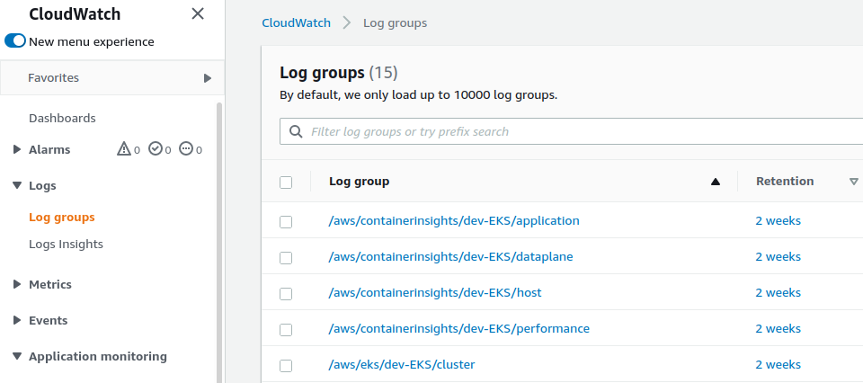

[](https://goreportcard.com/report/github.com/sgaunet/awslogcheck)


# awslogcheck

The purpose is to create a tool to parse cloudwatch logs and get a mail report with all occurences that doesn't match with regexp given (like logcheck but for AWS EKS applications, considering that logs are stored in cloudwatch thanks to fluentd or fluentbit).

Actually, the program can connect to AWS API through SSO profile or get the default config (need to give permissions to the EC2 that will run the program).

The check is done every hour. If there are logs that do not fit with rules, you will get one or multiples emails depending on the size of the report.(Need a mailgun account or an SMTP server).

# Configuration

The configuration files has the below format :

```
rulesdir: "/opt/awslogcheck/rules-perso"
imagesToIgnore:
  - fluent/fluentd-kubernetes-daemonset
  - 602401143452.dkr.ecr.eu-west-3.amazonaws.com/eks/kube-proxy
  - docker:stable
  - docker:dind
containerNameToIgnore:
  - aws-vpc-cni-init
  - helper
  - build
  - svc-0
logGroup: /aws/containerinsights/dev-EKS/application
aws_region: eu-west-3
mailSubject: awslogcheck
mailTo: 
mailFrom:
mailgun:
  domain: 
  apikey:
smtp:
  server:
  port: 
  login:
  password:
  tls: true/false
```

imagesToIgnore and containerNameToIgnore are golang regexp expression, you can test with [https://regex101.com/](https://regex101.com/)

The loggroup should be the loggroup created by fluentd/fluentbit deployment. awslogcheck won't be able to check another structure of events.




## Execution 

### EKS (docker image)

Check the deploy folder to launch in kubernetes. 

### In command line (SSO)

Login into and specify the profile to use with option -p :

```
aws sso login --profile dev
awslogcheck -c cfg.yml -p dev
```

### In command line (EC2)

```
awslogcheck  -g /aws/containerinsights/dev-EKS/application -c cfg.yml
```

Set the role below to get permissions from your EC2 to browse logs.

## Role for EC2

The program need permissions to consult cloudwatch. 

Policy example :

```
{
    "Version": "2012-10-17",
    "Statement": [
        {
            "Effect": "Allow",
            "Action": [ 
                            "logs:DescribeLogStreams",
                            "logs:GetLogEvents",
                            "logs:DescribeLogGroups"],
            "Resource": "*"
        }
    ]
}
```

Create with AWS cli :

```
$ aws iam create-policy --policy-name EksEc2PolicyCloudwatch --policy-document file://EksEc2PolicyCloudwatch.json --profile dev
Policy:
  Arn: arn:aws:iam::.......................
  AttachmentCount: 0
  CreateDate: '.................'
  DefaultVersionId: v1
  IsAttachable: true
  Path: /
  PermissionsBoundaryUsageCount: 0
  PolicyId: ..........................
  PolicyName: EksEc2PolicyCloudwatch
  UpdateDate: '.................'
```

# Deployment in kubernetes

You have manifests example in the deploy folder.

## Development

This tool uses the aws sdk golang v2. [Here is the doc.](https://pkg.go.dev/github.com/aws/aws-sdk-go-v2)

[Most of API calls use cloudwatchlogs.](https://pkg.go.dev/github.com/aws/aws-sdk-go-v2/service/cloudwatchlogs)

# FAQ

If you have error like (when using the SSO) :

```
ERROR: operation error STS: GetCallerIdentity, failed to sign request: failed to retrieve credentials: the SSO session has expired or is invalid: expected RFC3339 timestamp: parsing time "2021-11-18T15:55:16UTC" as "2006-01-02T15:04:05Z07:00": cannot parse "UTC" as "Z07:00"
exit status 1
```

[Update awscli](https://docs.aws.amazon.com/cli/latest/userguide/getting-started-install.html)


# Build

This project is using :

* golang 1.17+
* [task for development](https://taskfile.dev/#/)
* docker
* [docker buildx](https://github.com/docker/buildx)
* docker manifest
* [goreleaser](https://goreleaser.com/)

**A little comment, there is no tests, the initial development has been done in quick and dirty mode. Maybe, this problem will be adressed in the future but it's a side project with very very low priority so don't expect a lot of features or improvements.**

## Binary

```
task
```

## Build the image

```
task image
```

# Make a release

```
task release
```
